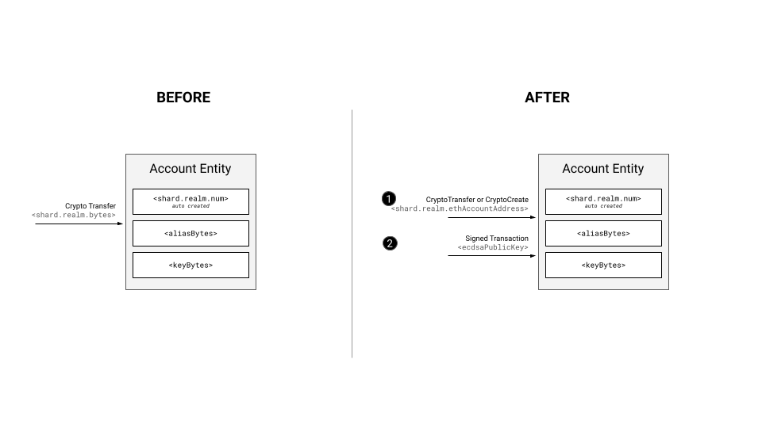

# Alias Configuration

## Purpose
Account aliases allow an account to be referenced via a different id than the `<shard>.<realm>.<num>` accountId format which is native to the Hedera ledger.
As part of [HIP 32](https://github.com/hashgraph/hedera-improvement-proposal/blob/master/HIP/hip-32.md) the functionality was made available via teh auto-create flow in which an ED25519 or ECDSA public key was provided and used as the alias.

To support greater scenario especially smart contract related scenarios for ECDSA based key the ledger needs to support additional ways of setting the alias at creation.

This document explains how additional Crypto transaction flows may be used to create an account with an alias.

## Goals

- Validate that an accounts alias and public keys map to each other
- Update alias specification to support ED/ECDSA public key or ethereumAddress styled conforming values
- Update the `CryptoCreate` transaction to support the provision of an alias
- Support the Lazy Account Creation Flow

## Non Goals

- Updating existing accounts alias fields

## Architecture

### Alias to Public Key Validation

### Support Public Key or Ethereum Address Alas

### Crypto Create Transaction Alias Logic

### Lazy Account Create Logic

## Non-Functional Requirements

- Support lazy account create initialization and completion TPS (100)

## Open Questions

## Acceptance Tests