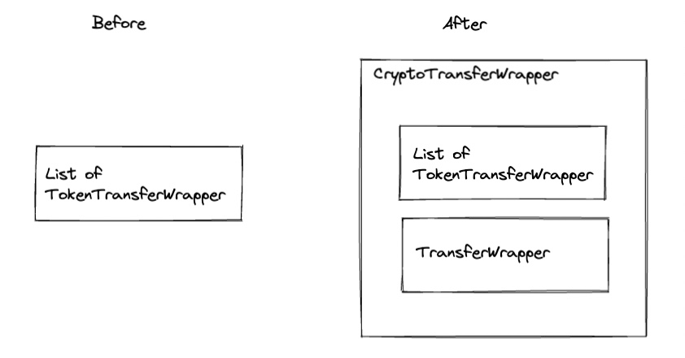

# Atomic CryptoTransfer

## Purpose

The existing Crypto transfer precompile functionality is missing the ability to atomically transfer `hbars` along with fungible and non-fungible tokens.  In addition, there is no support for using the approval mechanism.

The Crypto transfer precompile should be refactored to include this functionality in order to better align with HAPI.

This document details how to refactor the existing code in order to gain the additional functionality desired.

## Goals

When performing a Crypto transfer precompile:
- Allow for atomic transfers of hbars, fungible tokens and non-fungible tokens between accounts.
- Support `approval` functionality with transfers.
## Non Goals
Continued support for the existing interface for the `cryptoTransfer` precompile.  While support for the existing functionality will continue in the Hedera services layer for backwards compatibility, `IHederaTokenService` will be updated to only support the new function call.
## Architecture
Update the information passed into the `cryptoTransfer` precompile in order to allow for `hbar` transfers and `approval` functionality.  Refactor the Crypto transfer precompile in Hedera services to perform the transfers specified in the input parameters
## Non-Functional Requirements

### Hedera Smart Contract Changes

#### Update  `AccountAmount`  struct to support  `isApproval`

    struct AccountAmount {
          ...
    
          // If true then the transfer is expected to be an approved allowance and the
          // accountID is expected to be the owner. The default is false (omitted).
          bool isApproval;
      }

This creates a breaking change in the  `cryptoTransfer`  function hash since the  `AccountAmount`  and  `TokenTransferList`  struct hash changes and will require network support of both versions

#### Update  `NftTransfer`  struct to support  `isApproval`

      struct NftTransfer {
          ...
    
          // If true then the transfer is expected to be an approved allowance and the
          // accountID is expected to be the owner. The default is false (omitted).
          bool isApproval;
      }

This creates a breaking change in the  `cryptoTransfer`  function hash since the  `NftTransfer`  and  `TokenTransferList`  struct hash change and will require network support of both versions

#### Add a new struct for  `TransferList`  which is composed of  `AccountAmount[] transfers`

      struct TransferList {
          // Applicable to HBAR crypto currency. Multiple list of AccountAmounts, each of which
          // has an account, amount and isApproval flag.
          AccountAmount[] transfers;
      }

#### Update `cryptoTransfer` function with the following signature
`cryptoTransfer(TransferList, TokenTransferList[])`

### Hedera Services Changes
Currently, the `TransferPrecompile` class decodes and operates on a list of `TokenTransferWrapper` instances.  In order to additionally support transfers of hbars with minimal disruption, create new wrapper classes TransferWrapper and `CryptoTransferWrapper` as shown.

Fees and change operations will be modified to use the data in the CryptoTransferWrapper.

## Acceptance Tests

- Verify that transfers involving hbars, fungible tokens and non-fungible tokens work correctly.
- Verify that empty TransferList and TokenTransList arrays are handled as expected without error.
- Verify that the approval mechanism works as expected with transfers.
- Verify exception cases when net hbars transfers do not total 0.
  
