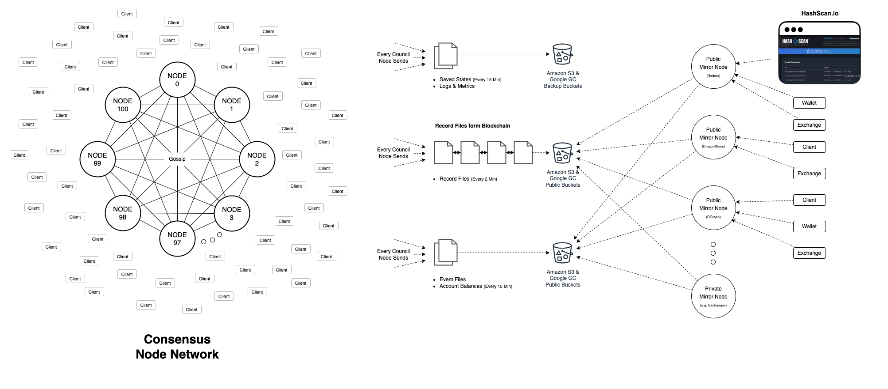

# Hedera Architecture and Design

This document details the system design for the Hedera Consensus Node software.

**WARNING: This document is a WIP!**

### Table of Contents
 - [Introduction](#introduction)
 - [Architecture](#architecture)
 - [Hedera Application](app/app.md)
   - [Fees](app/fees.md)
   - [gRPC](app/grpc.md)
   - [Records](app/records.md)
   - [States](app/states.md)
   - [Throttles](app/throttles.md)
   - [Workflows](app/workflows.md)
 - [Services](services/services.md)

## Introduction

Hedera is a fast, fair, and secure distributed ledger with low, fixed fees. It can be thought of as
a decentralized distributed database, with an immutable history of changes. The fundamental design
challenge of a decentralized distributed ledger is sorting transactions in a fast, fair, and
secure way. Algorithms that perform this task are known as _consensus_ algorithms. The consensus
algorithm used by Hedera is the **hashgraph**.

This document describes the architecture of a Hedera distributed ledger. It is applicable to the
publicly hosted hedera ledger, or any privately hosted ledger. This document is targeted at developers
who which to participate in developing the Hedera and hashgraph technology. Welcome aboard 😇.

## Architecture

A Hedera distributed ledger is made of _Consensus Nodes_ and _Mirror Nodes_. A consensus node is responsible for
gossiping with all other consensus nodes to "come to consensus" on which transactions should be executed, and the order
in which they should be executed, using the **hashgraph** consensus algorithm. Consensus nodes also maintain the current
state of all entities (accounts, tokens, files, topics, etc.) and execute transactions, in their consensus order, to
mutate the state identically on all nodes.

Clients use the Hedera API (HAPI) to submit transactions to the network. Periodically, consensus nodes write their
entire state to S3 compatible buckets. They also make available logs and metrics. They also upload account balance
files. They also produce and upload two different blockchains -- the chain of "event" files (the raw events produced
by the hashgraph algorithm in consensus order), and the chain of "record" files (the raw transactions and their
computed impact on state -- did the transaction complete successfully, did it change the balance, etc).

Mirror nodes download the record files and index them into their own internal databases. They then make this state
available to clients through some kind of API. It may be a REST API, a GraphQL API, a Rosetta API, or some other API.

The Consensus Node is broadly made up of a collection of modules that form the "platform", and a collection of modules
that form the "application". This document is for the application architecture. Separate documentation details the
architecture of the platform. We will discuss at a high level integration points between the Hedera application and
the hashgraph platform, and we will discuss at a high level other touch-points such as client SDKs and mirror nodes,
but our focus will be on the Hedera application components.

### Modules

From a modularity perspective, the application modules depend upon the platform modules, while the platform modules
**do not** depend on the application modules. In some cases, there may be application modules that replace platform
modules, but as that is speculative and not currently implemented, no further mention is made of that here.

The application modules include the following:
- `hedera-app`: The main application module. This is the entry point to the app. It ultimately depends on all modules
  that make up the Consensus Node, and no other modules depend on it. It is at the top of the dependency tree.
- `hedera-app-api`: This is the SPI for service modules. It defines APIs that are either implemented by the service
  module, or are implemented by the `hedera-app` module and passed to the service modules. In this way, code can be
  implemented by the app module and yet the service modules don't have to depend on that module, and they are isolated
  from the implementation details.
- Service modules: for example `hedera-token-service` and `hedera-file-service`. Each service module is actually made
  up of two modules, its API module (for example `hedera-token-service-api`) and its implementation module
  (for example `hedera-token-service`). This is done to break circular dependencies and enforce strong API boundaries
  between the services, and to make it easy to have multiple implementations of any module.

The `hedera-app` module implements all core services and interfaces required by service modules to function properly.
It is meant to isolate service modules from working directly with the hashgraph platform, and from gRPC, and other
implementation details. It is broadly responsible for:
- Networking and gRPC
- Protobuf
- Interfacing with the Hashgraph Platform
- State management
- Principle workflows (transaction ingestion, query handling, pre-consensus, handle-transaction)
- Record stream management
- Throttling
- Fee handling
- etc.

Each service module is responsible for:
- Defining APIs for working with the service at a POJO level, including any entities (for example *Account*)
- Implementing logic for persisting entities into a Merkle tree (typically by `MerkleMap` or `VirtualMap`)
- Implementing the service-specific query logic and transaction handling logic

**By design**, it is possible to completely and thoroughly test each service instance without running the entire
consensus node. Each service can be completely tested for all possible input and for the correct generation of
transaction records, and for all error conditions, without needing any of the actual functionality implemented by
`hedera-app`, or standing up a complete network.

**NEXT: [Application Module](app/app.md)**
