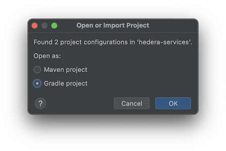
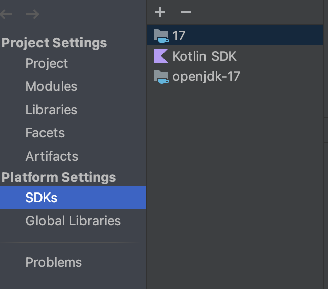
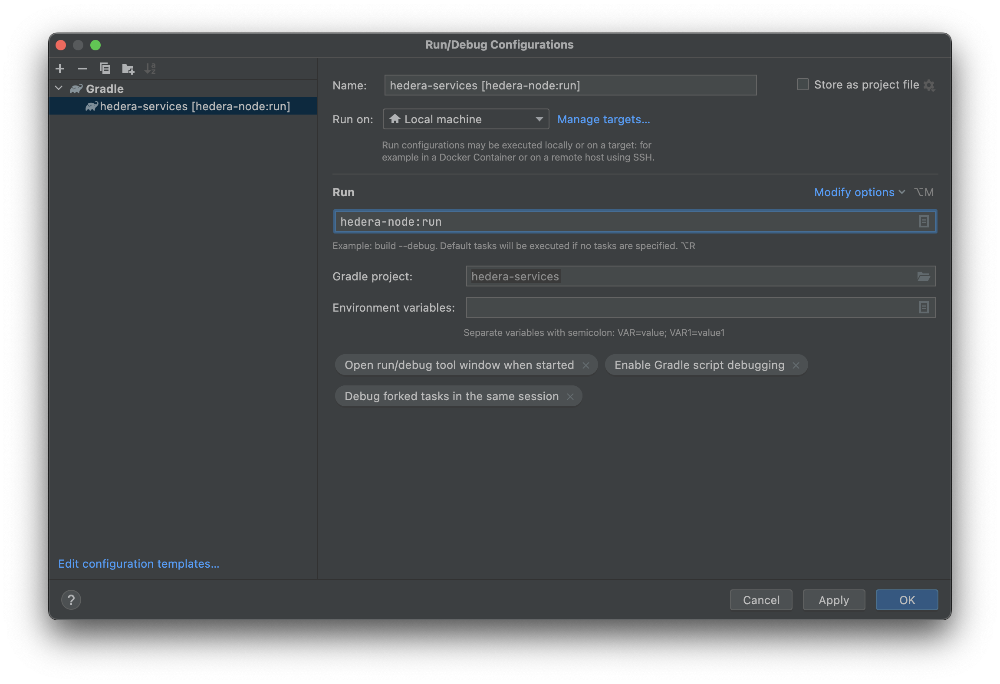
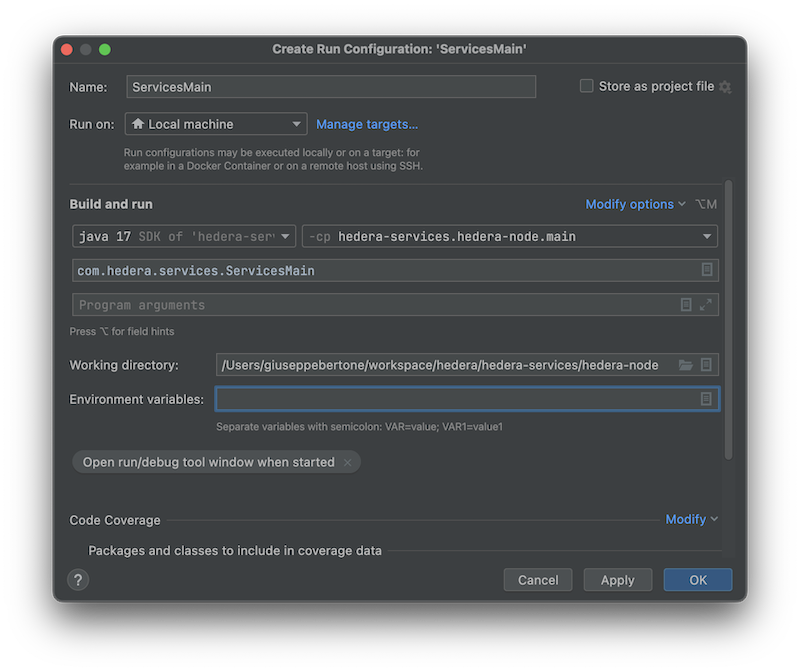
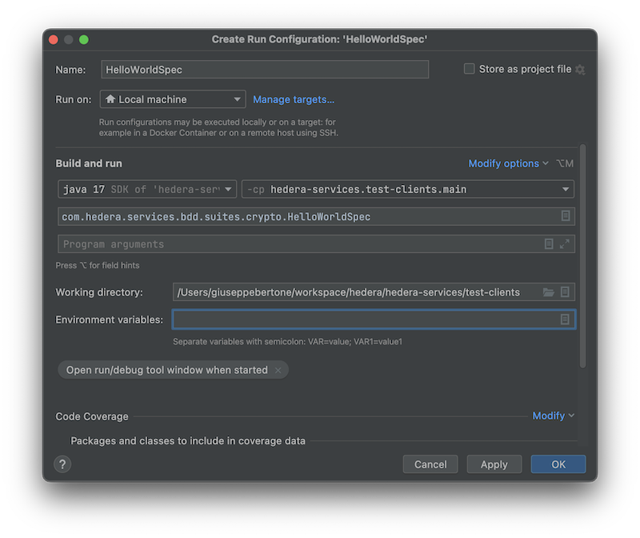

# IntelliJ quickstart

## JVM

OpenJDK 17 is required. You can [download it from the Adoptium website](https://adoptium.net/)
if you don't have it already.

## Preliminaries

Clone this repository:

```shell
git clone git@github.com:hashgraph/hedera-services.git
```

## Import the project

### Import as Gradle project

Note: you can read the [Gradle quickstart](./gradle-quickstart.md) guide for a detailed guide
to use gradle via command line with this repo.

From the IntelliJ launcher, choose `Open` and navigate to the `hedera-services` folder you just cloned.
When IntelliJ asks for the import type, choose _Gradle project_.



If IntelliJ complains about trusting the folder, choose `Trust Project`.


If IntelliJ notifies the presence of Maven configurations, just `Skip`


### Import as Maven Project (deprecated)

Optionally, you can still choose to import the project via Maven.
Please note **Maven support will be deprecated soon** and eventually removed in the `v0.29.x` releases.

From IntelliJ, choose `File -> Open` and navigate to the top-level `pom.xml`
under the `hedera-services` directory you just cloned. Open it as a project:


Make sure you are using OpenJDK 17 as the project SDK:



## Starting a local three-node network

`hedera-node/data/config` directory contains already configured files to bootstrap a
new Hedera Services network with three nodes. To read more about how properties are
sourced in Services, please see [here](./services-configuration.md).

### Gradle

Add a new Gradle configuration, set the `hedera-node:run` task in the `Run` field, and run it.



Note: subsequent runs will start from the last saved state of the network.
You can also use the `hedera-node:cleanRun` task to always start from a clean state.

### Maven

Open the Maven tool window, and run `mvn install -PdevSetup` in the root project:

This will both:

- Build the `hedera-node/data/apps/HederaNode.jar`
- Populate your `hedera-node/data/config/node.properties` if needed

Now browse to `com.hedera.services.ServicesMain`. Its
`main` method starts a network of Hedera Service nodes by
calling `com.swirlds.platform.Browser#main`, which is the
entrypoint to bootstrap the Platform app named by the
[_config.txt_](../hedera-node/config.txt) in the working
directory.

Run `ServicesMain#main` with an IntelliJ configuration whose working
directory is the `hedera-node` directory of your clone of this repo:



## Project started

You will see a monitor window appear, similar to:


And three black panes appear, similar to:


This node's name is "Alice" because of [Line 26](../hedera-node/config.txt#L26)
in the _config.txt_ present in your working directory.

Looking closer at _config.txt_, you can see you are running Hedera Services
(and not some other app) because [Line 12](../hedera-node/config.txt#L12)
points to the JAR file you just built; and there are three nodes in your
network because you specified "Bob" and "Carol" as well as "Alice".

In fact Alice, Bob, and Carol are all running on your local machine; and
communicating via the loopback interface. But each still has a private
instance of the Platform, and keeps its own state, just as it would in a
true distributed network.

During the initial startup, the network creates system accounts `0.0.1` through `0.0.100`.
It sets the key for each account to a `KeyList` of size one with a well-known Ed25519
key pairs. The network reads the key pairs in a legacy format from [here](../hedera-node/data/onboard/StartUpAccount.txt),
but the same key pairs is available in PEM format using the PKCS8 encoding
[here](../hedera-node/data/onboard/devGenesisKeypair.pem) (the passphrase is `passphrase`).

Even more explicitly, the 32-byte hex-encoded private and public keys of the Ed25519 key pairs are:

```text
Public: 0aa8e21064c61eab86e2a9c164565b4e7a9a4146106e0a6cd03a8c395a110e92
Private: 91132178e72057a1d7528025956fe39b0b847f200ab59b2fdd367017f3087137
```

## Submitting transactions to your local network

The _test-clients/_ directory in this repo contains a large number of
end-to-end tests that Hedera engineering uses to validate the behavior of
Hedera Services. Many of these tests are written in the style of a BDD
specification. For example, browse to
`com.hedera.services.bdd.suites.crypto.HelloWorldSpec`, which makes some minimal
assertions about the effects of a crypto transfer.

Run `HelloWorldSpec#main` with an IntelliJ configuration whose working
directory is the _test-clients/_ directory of your clone of this repo:



Because [`node=localhost`](../test-clients/src/main/resource/spec-default.properties)
in the _spec-default.properties_ controlling the `HelloWorldSpec` test, this
will run against your local network, culminating in logs similar to:

```shell
2020-01-31 15:42:21.299 INFO   170  HapiApiSpec - 'BalancesChangeOnTransfer' finished initial execution of HapiCryptoTransfer{sigs=2, payer=GENESIS, transfers=[0.0.1002 <- +1, 0.0.1001 -> -1]}
2020-01-31 15:42:21.302 INFO   80   HapiGetAccountBalance - 'BalancesChangeOnTransfer' - balance for 'sponsor': 999999999
2020-01-31 15:42:21.304 INFO   170  HapiApiSpec - 'BalancesChangeOnTransfer' finished initial execution of HapiGetAccountBalance{sigs=0, account=sponsor}
2020-01-31 15:42:21.307 INFO   80   HapiGetAccountBalance - 'BalancesChangeOnTransfer' - balance for 'beneficiary': 1000000001
2020-01-31 15:42:21.308 INFO   170  HapiApiSpec - 'BalancesChangeOnTransfer' finished initial execution of HapiGetAccountBalance{sigs=0, account=beneficiary}
2020-01-31 15:42:21.310 INFO   190  HapiApiSpec - 'BalancesChangeOnTransfer' - final status: PASSED!
2020-01-31 15:42:21.311 INFO   128  HelloWorldSpec - -------------- RESULTS OF HelloWorldSpec SUITE --------------
2020-01-31 15:42:21.311 INFO   130  HelloWorldSpec - Spec{name=BalancesChangeOnTransfer, status=PASSED}
```

(This client uses account `0.0.2` as the default payer, and is aware of the above
key pairs via its configuration in [_spec-default.properties_](../test-clients/src/main/resource/spec-default.properties)
under the `startupAccounts.path` key).

## Stopping/restarting the network

Stop the `ServicesMain` process in IntelliJ to shut down the network.

When you restart `ServicesMain`, the nodes will attempt to restore their
state from the _hedera-node/data/saved_ directory tree.
In general, for
this to work correctly, you should precede shutting down the network
by submitting a `Freeze` transaction; e.g. via the
[`FreezeIntellijNetwork`](../test-clients/src/main/java/com/hedera/services/bdd/suites/freeze/FreezeIntellijNetwork.java)
client.

:information_source:&nbsp; In case of an unclean shutdown, or unwanted
accumulation of logs and audit data in the local workspace, you can restore
a clean state using one of the following method:
- running the Gradle `hedera-node:clean` task
- running the Maven `antrun:run@app-clean` goal in the `hedera-node` project
- deleting the `hedera-node/data/saved`
