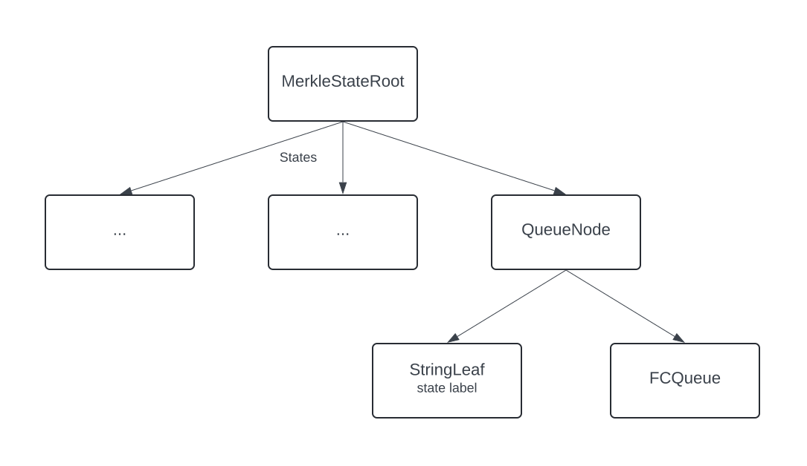
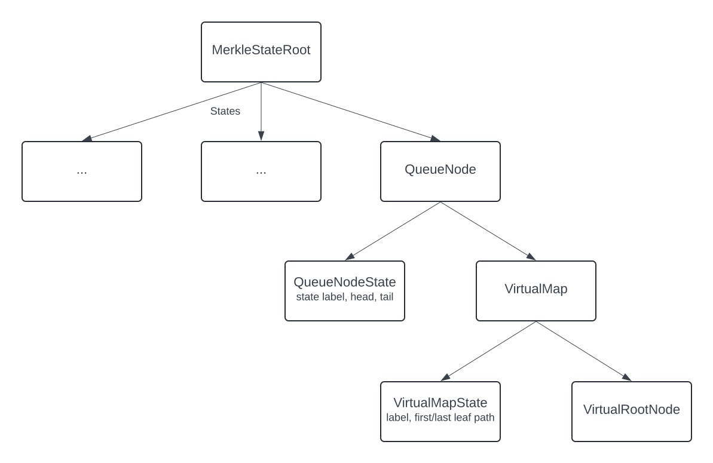

# Design proposal: queue states - migrate from FCQueue to VirtualMap

---

## Summary

This design proposal covers details how to re-implement Queue state APIs on top of `VirtualMap`
rather than `FCQueue` as it is today. The main goal is to have applications like Hedera services
unaffected, and have data migration fast enough to be done during software update cycle.

## Purpose and context

State APIs is an abstraction layer on top of the merkle state tree. This layer provides methods
and classes to work with ledger data regardless of how it's stored in memory and on disk. There
are 3 different state types supported:

* Singleton states: store a single value
* Queue states: store multiple values with queue-like APIs
* Key/value states: store multiple values with map-like APIs

For production use cases, queue states are implemented using a single `QueueNode` merkle node, which
is an internal merkle node with two children: a label and a queue. The label is a `StringLeaf`, and
the queue is an `FCQueue`.

`FCQueue` is an in-memory implementation of a queue. It provides all APIs expected from a queue,
like to add an element to the head of the queue or to poll an element at the tail of the queue. It
also provides efficient implementation of hashCode(). This is critical, since queues may contain
lots of elements, and queue hashes must be computed fast.

There are several drawbacks in `FCQueue`, too:

* All data is in memory
* When a state snapshot is taken, all queue elements are serialized to disk one by one
* During reconnects, the whole queue is serialized and sent to the learner

Instead, all the queue APIs can be implemented on top of a `VirtualMap`. It's more memory friendly,
optimizied for reconnects and snapshots.

## Architecture

### Diagrams

|              Current              |                Proposal                |
|-----------------------------------|----------------------------------------|
|  |  |

### Java classes

No changes to `ReadableQueueState` and `WritableQueueState` interfaces.

No changes to `ReadableQueueStateImpl` and `WritableQueueStateImpl` classes.

`QueueNode`:

* No longer marked as `@Deprecated`
* Has two children: `QueueNodeState` (was: `StringLeaf`) and `VirtualMap` (was: `FCQueue`)

`QueueNodeState`:

* A simple leaf node similar to `StringLeaf`, but contains two long values in addition to
  a string value
* These two longs are the head and the tail of the queue - see below

### Queue operations

The underlying `VirtualMap` will map longs to E, where E is the type of the queue. The longs
will be used to organize the links between queue elements: if an element has position N, then
its next element has position N+1. When an empty queue is created, its head and tail are both
pointing to 0. The head is _the next_ position to add, the tails is _the current_ position to
remove. If head and tail positions are equal, the queue is empty.


**Add**:

* Insert an element to the head position
* Increment the head by one
* Code snippet:

```java
public void add(final E element) {
    map.put(head++, element);
}
```


**Poll / remove**:

* Check if the queue is empty
* Remove the element from the tail position
* Increment the tail by one
* Code snippet:

```java
public E remove() {
    if (tail == head) {
        return null;
    }
    return map.remove(tail++);
}
```


### Serialization, deserialization, hashing, reconnects

All provided by `VirtualMap`.

`QueueNodeState` will write both its long values in addition to the label during serialization.

### Data serialization and deserialization

`FCQueue` today stores all data items in memory. When the queue is written to a snapshot, all
items are serialized as `SelfSerializable`. To store items in `VirtualMap`, key and value
serializers are to be provided. The key serializer will be trivial, as keys are longs. The value
serializer will be implemented using the codec provided by `QueueNode`, similar to how key/value
states work.

## Alternative rejected approaches

### FCQueue on disk

To overcome the major `FCQueue` limitation about all elements stored in memory, on-disk
implementation could be provided. Queue elements could be stored in multiple files on disk.
Once queue head is past the last element of a file, the file could be deleted.

Pros:
* Limited memory usage
* Still fast hashing by maintaining the running hash
* Fast snapshots similar to virtual maps, when data files are hard-linked to snapshot dirs

Cons:
* Incompatible with upcoming state changes, when all state data is moved to a single huge
virtual map
* During reconnects, the whole queue is still sent to the learner, or a separate reconnect
implementation is provided for queues

## Data migration

Current production states contain a few queue state nodes, all are tiny except transaction
receipts. However, even the largest queue is expected to be small enough, so it can be migrated
to a virtual map during Hedera node software update window.

Migration code will be in `QueueNode.migrate()` This method will get its right child (which is
`FCQueue`), iterate over it, insert all elements in the right order to a virtual map, then set
the map as the new right child. The left child will be changed from a simple string leaf to a
`QueueNodeState` leaf node.

## Testing

This feature doesn't add any new functionality. All existing Hedera unit tests should pass with
the new queue state implementation. Unit tests specific to `QueueNode` may need to be updated.

### Migration testing

Migration testing will use a real mainnet state generated with a previous Hedera version. This
state will be used to start a node with the latest version that includes queue state changes.

## Performance impact

**Queue operations (add, remove)**: both `FCQueue` and `VirtualMap` add and remove elements fast,
O(1) complexity. No performance impact is expected.

**Hashing**: `FCQueue` has a very efficient hashing algorithm, it hashes only newly inserted
elements and "unhashes" removed elements. Complexity is O(N), where N is the number of elements
added to or removed from the queue in a single round. It's done on a single thread, though.
`VirtualMap` needs to rehash more entities because of its tree structure, so it's complexity is
O(N) * O(log2(M)), where M is the size of the queue, which is not expected to grow a lot in the
future, so log2(M) is rather a constant multiplier. Besides that, virtual map hashing is done
on multiple threads in parallel. Overall, no significant performance impact is expected.

**Serialization (including snapshots)**: `VirtualMap` is much faster than `FCQueue`, since it
only needs to serialize a small portion of its data (virtual node cache), while `FCQueue`
always serializes all its elements. Positive performance impact is expected.

**Reconnects**: `FCQueue` is transferred to the learner completely, even if just a few elements
are dirty in the queue. It's done by serializing the queue node to the socket stream, which
is slow in itself. `VirtualMap` is synchronized more efficiently, using many threads and
sending only dirty virtual nodes (plus some overhead). Minor positive performance impact is
expected.
